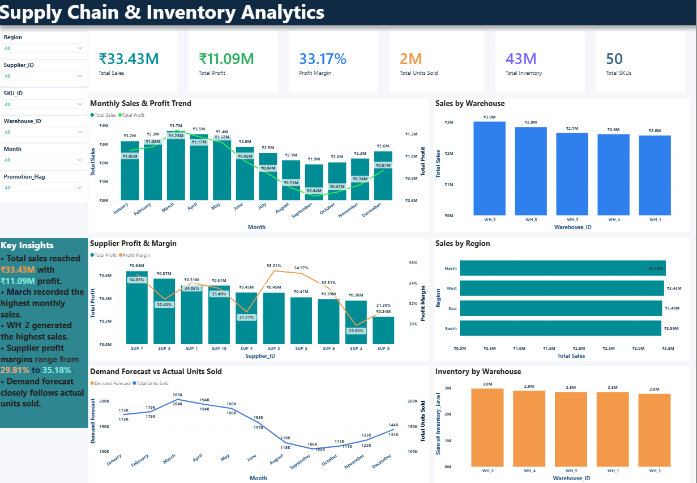

# Supply_Chain_Inventory_Analytics
# Supply Chain & Inventory Analytics

## 📌 Project Overview

This project analyzes supply chain, inventory, sales, supplier, warehouse, and demand data using Excel, MySQL, and Power BI.

The goal is to identify sales trends, profitability, inventory patterns, supplier performance, warehouse performance, and demand forecast accuracy.

## 🛠️ Tools & Technologies

- Excel – Data cleaning and preparation
- MySQL – Data analysis using SQL
- Power BI – Interactive dashboard and visualization
- GitHub – Project documentation and version control

## 📊 Key KPIs

- Total Sales: ₹33.43M
- Total Profit: ₹11.09M
- Profit Margin: 33.17%
- Total Units Sold: 1.83M
- Total Inventory: 43.03M
- Total SKUs: 50
- Total Suppliers: 10
- Total Warehouses: 5

## 🔍 Key Insights

- March recorded the highest monthly sales at approximately ₹3.7M.
- WH_2 generated the highest warehouse sales.
- Supplier profit margins ranged from approximately 29.81% to 35.18%.
- Demand forecast closely followed actual units sold across the analyzed months.
- Overall profit margin was 33.17%.

## 📈 Dashboard

## 📂 Project Files

- `Supply_Chain_Analytics.pbix` – Power BI dashboard
- `Supply_Chain_Dashboard.png` – Dashboard screenshot
- `Supply_chain_analytics.sql` – MySQL analysis queries
- `Supply_Chain_Analytics_Cleaned...` – Cleaned dataset

## 🎯 Business Questions

- What are the monthly sales and profit trends?
- Which warehouses generate the highest sales?
- Which suppliers have higher profit margins?
- How is inventory distributed across warehouses?
- How closely does demand forecast match actual units sold?
- Which regions contribute the most sales?

## 👤 Author

Akshay
